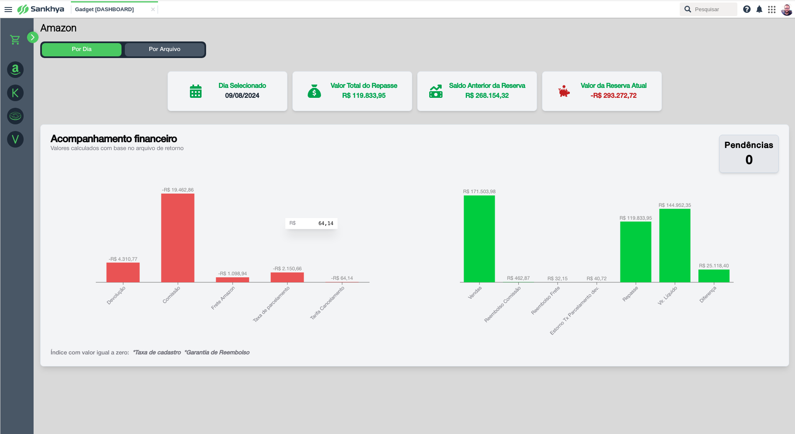

# Dashboard Sankhya 📊

[](https://reactjs.org)
[](https://www.typescriptlang.org)
[](https://tailwindcss.com)
[](https://www.radix-ui.com)
[](https://recharts.org)

## 🚀 Sobre o Projeto

O Dashboard Sankhya é uma aplicação moderna e eficiente para visualização e análise de dados. Construído com as tecnologias do ecossistema React, oferece uma experiência de usuário fluida e responsiva. Esse dashboard foi desenvolvido para a equipe do setor financeiro poder ter uma melhor visualização de métricas e índices a respeito dos arquivos de conciliação financeira.

## 📸 Visualização

Aqui está uma prévia da interface do Dashboard Sankhya:



> **Nota:** Para mais imagens e detalhes sobre a interface, confira a pasta [.gitassets](.gitassets/) do projeto.

## 🛠️ Tecnologias Principais

- **Frontend**
  - React 18.3.1 🏗️
  - TypeScript 5.6.2 🎯
  - Tailwind CSS 3.4.11 🎨
  - Radix UI v1.1.2 🎨
  - Recharts 2.13.0 📈

- **Ferramentas de Desenvolvimento**
  - Webpack 5.94.0 📦
  - Babel 7.25.2 🔄
  - Biome JS

## 🚀 Como Iniciar

1. Clone o repositório:
```bash
git clone [URL_DO_REPOSITORIO]
cd dashboard-sankhya
```

2. Instale as dependências:
```bash
npm install
```

3. Inicie o servidor de desenvolvimento:
```bash
npm run dev
```

## 📦 Scripts Disponíveis

- `npm run dev` - Inicia o servidor de desenvolvimento
- `npm run build` - Gera a build de produção
- `npm run lint` - Executa o linting do código
- `npm run format` - Formata o código
- `npm run check` - Verifica e corrige problemas no código

---

Feito com ❤️ por [Rafael Lima]